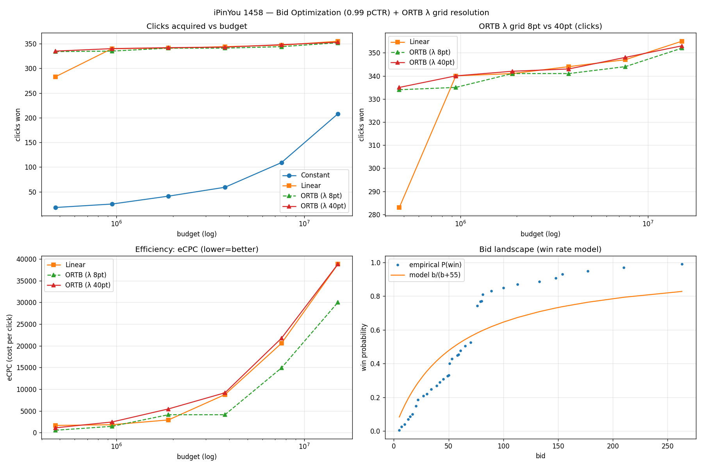
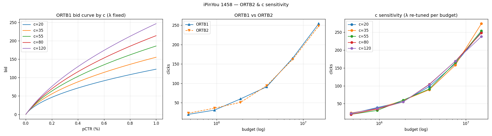

# CTR / CVR Prediction & Bid Optimization (Criteo + Ali-CCP + iPinYou)

광고 시스템의 랭킹(예측) → 입찰(의사결정) 흐름을 공개 데이터로 재현.

- CTR 예측 — Criteo (45.8M rows), 모델 5종 비교
- CTR + CVR 멀티태스크 — Ali-CCP, ESMM (CTCVR = CTR × CVR)
- 입찰 최적화 — iPinYou RTB, pCTR → 입찰가 변환 (Linear / ORTB) + 예산 제약 평가

## Dataset

| Dataset | Task | 크기 | Split |
|---|---|---|---|
| Criteo (Kaggle) | CTR | 45,840,617 rows / 13 num + 26 cat | 시간순 앞 40M train / 뒤 5.8M val |
| Ali-CCP (IJCAI-18) | CTR + CVR | ~85M rows | 제공 split (train 42.3M / val·test 각 21.5M) |
| iPinYou 2013 (1458) | Bidding | imp 3.08M / bid 14.7M rows | 시간순 6/06–6/11 train / 6/12 test |

- Criteo 결측: I12 76.5%, I1/I10 45.4%, C22 76.3%, C19/20/25/26 44%
- Ali-CCP label: CTR 0.0389 / CVR(clicked) 0.0054 / CTCVR 0.000208
- iPinYou 1458: CTR 0.0795%, PayingPrice 평균 68.9 / median 60. conversion 0건이라 CVR은 Ali-CCP에서 진행

## Tech Stack

- Language: Python 3.12, PyTorch 2.1 (CUDA 12.6)
- CTR/CVR: LR, FM, DeepFM, DCN v2, AutoInt, ESMM
- 입찰: Logistic Regression (pCTR, feature hashing 2^20) + Linear / ORTB1 / ORTB2
- bid landscape: Kaplan-Meier win rate model, 2nd-price 기대비용 기반 λ 이분탐색
- 전처리: num fillna(0)→clip(0)→log1p / cat min_freq=10 vocab 인덱싱

## 모델

| Model | 핵심 | 논문 |
|---|---|---|
| LR | 선형 baseline | McMahan 2013 |
| FM | 2nd-order interaction | Rendle 2010 |
| DeepFM | FM + DNN 병렬 | Guo 2017 |
| DCN v2 | Cross Network + DNN | Wang 2021 |
| AutoInt | Self-Attention interaction | Song 2019 |
| ESMM | CTR+CVR 멀티태스크 | Ma 2018 |
| Linear / ORTB | pCTR → 입찰가 변환 | Perlich 2012 / Zhang 2014 |

## Evaluation Results

### Criteo CTR (val)

| Model | AUC | Log Loss | Params |
|---|---|---|---|
| LR | 0.7546 | 0.5075 | 1.09M |
| FM | 0.7714 | 0.4912 | ~17M |
| DeepFM | 0.7829 | 0.4779 | 18.95M |
| DCN v2 | 0.7980 | 0.4563 | 18.26M |
| AutoInt | 0.7986 | 0.4556 | 17.72M |

batch 4096, Adam lr=1e-3, 1 epoch (FM 2 epoch). interaction 모델링할수록 AUC 상승.

DCN v2 ≈ AutoInt (AutoInt +0.0006, 추론은 DCN이 빠름). FM은 std=1 초기화에서 logit 폭발(-54~40) → std=0.01로 해결.

시간순 split이라 논문(랜덤 split)보다 약간 낮음 (leakage 방지).

### Ali-CCP ESMM

| Metric | Val (best, ep3) | Test |
|---|---|---|
| CTR AUC | 0.6241 | 0.6240 |
| CVR AUC | 0.6797 | 0.6654 |
| CTCVR AUC | 0.6406 | 0.6326 |

Criteo와 절대 AUC 직접 비교 불가 (익명 ID 위주, label 희소). 공개 ESMM 벤치마크도 0.62~0.68대.

CVR 단독 학습은 sample selection bias + data sparsity 발생 → ESMM은 pCTCVR = pCTR × pCVR로 유도해 동시 해결.

CTR loss(0.157) vs CTCVR loss(0.002) 약 100배 차이 → loss weighting 튜닝 여지. ep3 최고, 이후 과적합.

### iPinYou CTR (test 6/12, tag 제외)

| 지표 | 값 |
|---|---|
| AUC | 0.7092 (논문 LR 1458 ≈ 0.71) |
| 실제 CTR | 0.0796% |
| avg pCTR (raw → cal) | 1.0128% → 0.1041% |
| logloss (raw → cal) | 0.01372 → 0.00632 |

CTR 0.08% 불균형 → negative downsampling 10% 후 p/(p+(1-p)/w) 재보정 (He 2014).

AUC는 보정 무관, 입찰식은 pCTR 절대값을 쓰므로 보정 필수 (안 하면 과대입찰).

### iPinYou — tag ablation (AUC 0.99 원인)

| 설정 | AUC | 기여 |
|---|---|---|
| (A) tag 전부 | 0.9897 | — |
| (B) 11278만 제거 | 0.8236 | 11278 단독 +0.166 |
| (C) tag 전부 제거 | 0.7092 | 나머지 태그 +0.114 |

AUC 0.99 → leakage 의심 → 피처 ablation으로 UserTags 특정 (CreativeID/click혼입/train-test분리는 배제).

11278(In-market/clothing) CTR 34% (평균 430배), 단 보유자 65.6% 미클릭 → 사전 타게팅 신호 (누수 아님).

0.99는 단일 태그가 아닌 in-market 태그 누적. 입찰 비교 변별력 위해 tag 제외(0.71) 채택.

### iPinYou — 예산별 입찰 전략 (획득 클릭 수)

| 예산 | Constant | Linear | ORTB |
|---|---|---|---|
| full/64 | 18 | 22 | 20 |
| full/32 | 25 | 31 | 33 |
| full/16 | 41 | 58 | 64 |
| full/8 | 59 | 101 | 92 |
| full/4 | 109 | 174 | 172 |
| full/2 | 208 | 262 | 259 |

예산 = full_cost(전부 낙찰 비용)의 1/N, 예산별 파라미터 재탐색.

전 구간 Linear/ORTB > Constant, 빡빡할수록 격차 큼 (Zhang 2014 재현). 빡빡한 구간 ORTB eCPC 더 낮음.

완전 재탐색 시 Linear ≈ ORTB → ORTB의 강점은 재튜닝 없는 강건성.

오른쪽 bid landscape는 단순 모델 b/(b+55)이 시장가 급경사를 못 따라가는 한계를 보여줌 → KM으로 보완.

### iPinYou — 정식 ORTB (KM 기반, 시장가 비관측)

| 항목 | 내용 |
|---|---|
| win rate model | W(b)=b/(b+c0), 시장가 급경사 못 따라감 → KM으로 대체 |
| λ 결정 | 2nd-price 기대비용 Σ W(bid)·E[market\|market≤bid] 기반 이분탐색 |
| 결과 | 시장가 비관측 KM-ORTB가 오라클 ORTB와 거의 일치 |
| ORTB1 vs ORTB2 | 성능 유사 |
| c 민감도 | λ 재탐색이 흡수, 변동 6~20% |

### iPinYou — selection bias (bid 로그 기반 진짜 KM)

| bid | KM (진짜) | naive (이긴 것만) |
|---|---|---|
| 20 | 0.038 | 0.181 |
| 60 | 0.106 | 0.505 |
| 100 | 0.175 | 0.834 |
| 200 | 0.200 | 0.956 |

bid 로그 win 20.9% / lose(censored) 79.1%. naive(이긴 것만)는 bid 100에서 win rate를 0.83으로 추정, 진짜 KM은 0.18 → 약 5배 과대추정.

실제 1458 입찰(300, win 20.9%)과 KM 200 근처 수렴값(0.2)이 일치 

→ 이긴 데이터만 보면 win rate 심하게 과대추정, censored 반영해야 실제 시장에 가까움.

1458 입찰가 300 단일 상수라 입찰가별 win rate 곡선 추정 자체는 불가 

→ 탐색 없는 단일 정책의 selection bias. bid landscape forecasting은 입찰가 탐색 데이터 필요.

## 실제 광고 시스템 구조

| 단계 | 역할 | 기술 | 본 프로젝트 |
|---|---|---|---|
| 1. Candidate Generation | 수백만 → 수백 | Two-Tower, ANN | - |
| 2. Ranking | 수백 → 수십 | DeepFM, DCN, ESMM | Criteo / Ali-CCP |
| 3. Re-ranking | 다양성·제약 | MMR, 룰 | - |
| 4. Bidding | 입찰가 결정 | Linear / ORTB, KM win rate | iPinYou |
| 5. Budget Pacing | 예산 고갈 방지 | 예산 제어 | 예산 제약 시뮬레이션 |

## Roadmap

- [x] Criteo CTR 5종 비교 (LR/FM/DeepFM/DCN v2/AutoInt)
- [x] Ali-CCP ESMM 멀티태스크 (CTCVR = pCTR × pCVR)
- [x] iPinYou CTR + leakage 4단계 검증 (tag 원인 규명)
- [x] 입찰 전략 Constant/Linear/ORTB 예산별 비교
- [x] KM bid landscape + 정식 ORTB (오라클 근접) + c 민감도
- [ ] 시퀀스 모델 (DIN/DIEN/SASRec)

## 임베딩 시각화

