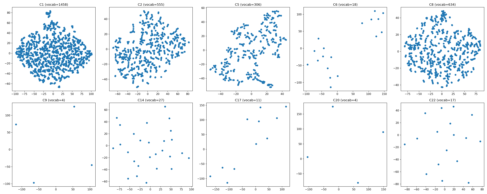

# CTR Prediction Model Comparison (Criteo Dataset)

## 프로젝트 개요
Criteo Display Advertising Challenge 데이터셋(45M rows)으로 CTR 예측 모델 5종 비교

## 데이터셋
- **출처**: Criteo Display Advertising Challenge (Kaggle)
- **크기**: 45,840,617 rows
- **Features**: 13 numerical (I1~I13) + 26 categorical (C1~C26) + label
- **결측값**: I12(76.5%), I1/I10(45.4%), C22(76.3%), C19/C20/C25/C26(44%) 등

## 전처리
- **Numerical**: `fillna(0)` → `clip(lower=0)` → `log1p` → `float32`
- **Categorical**: min_freq=10 미만 → `unknown(0)` 처리 → vocab 기반 정수 인덱스
- **Split**: 시간순 정렬 기준 앞 40M → train / 뒤 5.8M → val (data leakage 방지)

## 모델

| Model | 핵심 아이디어 | 논문 |
|-------|-------------|------|
| LR | 선형 baseline | McMahan et al. 2013 |
| FM | 2nd-order feature interaction | Rendle 2010 |
| DeepFM | FM + DNN 병렬 | Guo et al. 2017 |
| DCN v2 | Cross Network + DNN | Wang et al. 2021 |
| AutoInt | Self-Attention 기반 interaction | Song et al. 2019 |

## 실험 결과

| Model | AUC | Log Loss | Parameters |
|-------|-----|----------|------------|
| LR | 0.7546 | 0.5075 | 1,085,741 |
| FM | 0.7714 | 0.4912 | ~17M |
| DeepFM | 0.7829 | 0.4779 | 18,952,974 |
| DCN v2 | 0.7980 | 0.4563 | 18,259,872 |
| AutoInt | 0.7986 | 0.4556 | 17,719,122 |

> 학습 환경: GPU(CUDA 12.6), batch_size=4096, Adam lr=1e-3, 1 epoch (FM은 2 epoch)

## 주요 발견

### 1. Feature Interaction 효과
LR → FM → DeepFM 순으로 AUC 상승. feature 간 상호작용을 모델링할수록 성능 향상.

### 2. FM 초기화 문제
FM 2차 항(`0.5 * (||sum(vi)||² - sum(||vi||²))`)이 기본 초기화(std=1)에서 logit 폭발(-54 ~ 40) 발생.
`std=0.01`로 초기화 후 안정적 학습 가능.

### 3. DCN v2 vs AutoInt
Cross Network(DCN)와 Self-Attention(AutoInt) 모두 비슷한 성능(0.798x).
AutoInt가 0.0006 높지만 추론 속도는 DCN이 빠름.

### 4. 시간순 Split
랜덤 split 대신 시간순 split 적용. 실제 서비스와 동일한 세팅으로 data leakage 방지.
논문(랜덤 split) 대비 AUC가 약간 낮게 나오는 원인.

## Embedding 시각화
FM으로 학습된 categorical embedding을 t-SNE로 2차원 시각화.
비슷한 클릭 패턴을 가진 카테고리값끼리 embedding 공간에서 군집화되는 경향 확인.

## 한계 및 향후 계획
- Criteo는 feature semantic 비공개로 해석 한계
- CVR 데이터 없어 CTR만 가능
- **IJCAI-18 (Ali-CCP)** 데이터로 CTR + CVR 멀티태스크 학습 (ESMM) 예정

## 환경
```
Python 3.12
PyTorch 2.1 (CUDA 12.6)
pandas, numpy, scikit-learn, matplotlib
```



