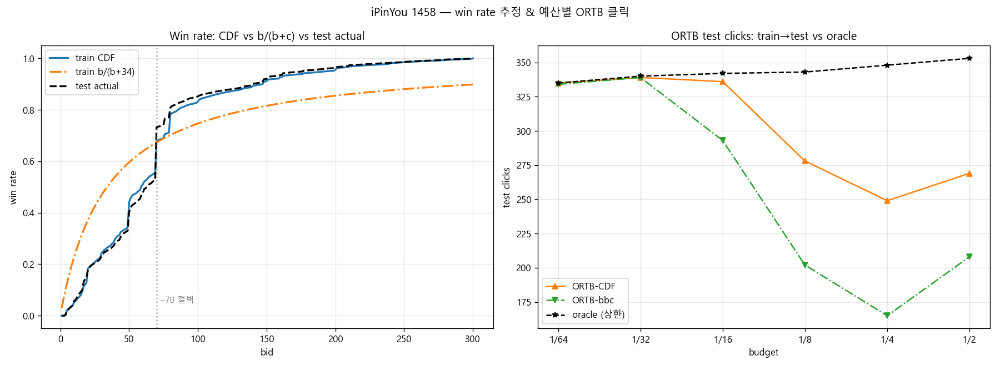
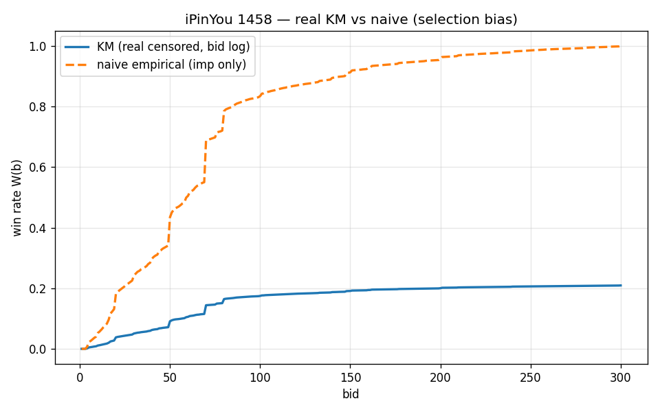

# CTR / CVR Prediction & Bid Optimization (Criteo + Ali-CCP + iPinYou)

광고 시스템의 랭킹(예측) → 입찰(의사결정) 흐름을 공개 데이터로 재현.

- CTR 예측 — Criteo (45.8M rows), 모델 5종 비교
- CTR + CVR 멀티태스크 — Ali-CCP, ESMM (CTCVR = CTR × CVR)
- 입찰 최적화 — iPinYou RTB, pCTR → 입찰가 변환 (Linear / ORTB) + 예산 제약 평가

## Dataset

| Dataset | Task | 크기 | Split |
|---|---|---|---|
| Criteo (Kaggle) | CTR | 45,840,617 rows / 13 num + 26 cat | 시간순 앞 40M train / 뒤 5.8M val |
| Ali-CCP (IJCAI-18) | CTR + CVR | ~85M rows | train 42.3M / val·test 각 21.5M |
| iPinYou 2013 (1458) | Bidding | imp 3.08M / bid 14.7M rows | 시간순 6/6–6/11 train / 6/12 test |

- Criteo 결측: I12 76.5%, I1/I10 45.4%, C22 76.3%, C19/20/25/26 44%
- Ali-CCP label: CTR 0.0389 / CVR(clicked) 0.0054 / CTCVR 0.000208
- iPinYou 1458: CTR 0.0795%, PayingPrice 평균 68.9 / median 60. conversion 0건이라 CVR은 Ali-CCP에서 진행

## Tech Stack

- Language: Python 3.12, PyTorch 2.1 (CUDA 12.6)
- CTR/CVR: LR, FM, DeepFM, DCN v2, AutoInt, ESMM
- 입찰: Logistic Regression (pCTR, feature hashing 2^20) + Linear / ORTB1 / ORTB2
- bid landscape: Kaplan-Meier win rate model, 2nd-price 기대비용 기반 λ 이분탐색
- 전처리: num fillna(0)→clip(0)→log1p / cat min_freq=10 vocab 인덱싱

## 모델

| Model | 핵심 | 논문 |
|---|---|---|
| LR | 선형 baseline | McMahan 2013 |
| FM | 2nd-order interaction | Rendle 2010 |
| DeepFM | FM + DNN 병렬 | Guo 2017 |
| DCN v2 | Cross Network + DNN | Wang 2021 |
| AutoInt | Self-Attention interaction | Song 2019 |
| ESMM | CTR+CVR 멀티태스크 | Ma 2018 |
| Linear / ORTB | pCTR → 입찰가 변환 | Perlich 2012 / Zhang 2014 |

## Evaluation Results

### Criteo CTR (val)

| Model | AUC | Log Loss | Params |
|---|---|---|---|
| LR | 0.7546 | 0.5075 | 1.09M |
| FM | 0.7714 | 0.4912 | ~17M |
| DeepFM | 0.7829 | 0.4779 | 18.95M |
| DCN v2 | 0.7980 | 0.4563 | 18.26M |
| AutoInt | 0.7986 | 0.4556 | 17.72M |

## AutoInt vs DCN v2 추론 벤치마크 (GPU, warmup 20 / iter 200)

| batch | model | mean(ms) | std | p50 | p99 | throughput(/s) |
|-------|---------|---------:|------:|------:|------:|---------------:|
| 1     | AutoInt | 1.502 | 0.577 | 1.205 | 2.766 | 666 |
| 1     | DCN v2  | 0.595 | 0.123 | 0.563 | 1.216 | 1,682 |
| 256   | AutoInt | 1.374 | 0.497 | 1.162 | 2.405 | 186,358 |
| 256   | DCN v2  | 0.932 | 0.261 | 1.030 | 1.550 | 274,531 |
| 4096  | AutoInt | 6.522 | 0.371 | 6.465 | 7.505 | 628,000 |
| 4096  | DCN v2  | 1.163 | 0.203 | 1.101 | 1.739 | 3,521,204 |

**DCN v2 우위**: batch=1 단건 2.5배 / batch=4096 throughput 5.6배. p99·std 모두 DCN이 낮아 tail latency 안정적. AUC

batch 4096, Adam lr=1e-3, 1 epoch (FM 2 epoch). interaction 모델링할수록 AUC 상승.

DCN v2 ≈ AutoInt (AutoInt +0.0006, 추론은 DCN이 빠름). FM은 std=1 초기화에서 logit 폭발(-54~40) → std=0.01로 해결.

시간순 split이라 논문(랜덤 split)보다 약간 낮음 (leakage 방지).

### Ali-CCP ESMM

| Metric | Val (best, ep3) | Test |
|---|---|---|
| CTR AUC | 0.6241 | 0.6240 |
| CVR AUC | 0.6797 | 0.6654 |
| CTCVR AUC | 0.6406 | 0.6326 |

Criteo와 절대 AUC 직접 비교 불가 (익명 ID 위주, label 희소). 공개 ESMM 벤치마크도 0.62~0.68대.

CVR 단독 학습은 sample selection bias + data sparsity 발생 → ESMM은 pCTCVR = pCTR × pCVR로 유도해 동시 해결.

CTR loss(0.157) vs CTCVR loss(0.002) 약 100배 차이 → loss weighting 튜닝 여지. ep3 최고, 이후 과적합.

### iPinYou CTR 예측 (test 6/12, 1458 단일 캠페인)

| 지표 | 값 (tag 포함, 메인) |
|---|---|
| AUC | 0.9897 |
| 실제 CTR | 0.0796% |
| avg pCTR (raw → cal) | 0.4480% → 0.1168% |
| logloss (raw → cal) | 0.00531 → 0.00169 |

CTR 0.08% 불균형 → negative downsampling 10% 후 p/(p+(1-p)/w) 재보정 (He 2014).

AUC는 보정 무관, 입찰식은 pCTR 절대값을 쓰므로 보정 필수 (안 하면 과대입찰).

### iPinYou — AUC 0.99 이상 탐지 → 원인 규명

처음 전체 피처(UserTags 포함)로 학습했더니 AUC가 0.99로 비정상적으로 높게 나옴 → leakage 의심.

피처 ablation으로 원인을 UserTags로 특정 (CreativeID 혼입 / click 누수 / train-test 분리 오류는 차례로 배제).

| 설정 | AUC | 기여 |
|---|---|---|
| (A) tag 전부 포함 | 0.9897 | — |
| (B) 11278만 제거 | 0.8236 | 11278 단독 +0.166 |
| (C) tag 전부 제거 | 0.7092 | 나머지 태그 +0.114 |

11278(In-market/clothing): 보유자 CTR 34%(평균의 약 430배). 단 보유자 65.6%가 미클릭 → 미래 정보 누수가 아니라 사전 타게팅 신호로 판정 (누수라면 보유=클릭이어야 함).

이후 벤치마크 논문(Zhang 2014, Table 4)을 확인한 결과 1458 LR AUC = 0.9881 — 논문 역시 UserTags를 binary 피처로 포함해 동일하게 높은 AUC를 얻었음을 확인. 본 결과(0.9897)가 이를 재현하며, in-market 태그가 누수가 아닌 정상 신호임을 뒷받침.

→ tag 포함(0.99)을 CTR 메인 모델로 채택하고 입찰 시뮬레이션에도 동일 pCTR 사용. (C) tag 제거(0.71)는 in-market 태그의 기여를 분리한 ablation 결과이며, 아래 pCTR 품질 비교에만 사용.

## iPinYou 1458 — 입찰 전략 평가 (train에서 λ 결정 → test 평가)

**평가 원칙.** 입찰 파라미터(ORTB λ, Linear base, Const c0)는 train(6/06–6/11)에서 결정해 test(6/12)에 적용한다.
test에서 직접 λ를 고른 것은 미래를 본 것이라 **oracle(상한선)**으로만 쓴다. λ는 그리드 대신 **bisection**으로 푼다(비용이 λ에 단조, Zhang 2014 방식).
win rate 모델은 imp 로그 기반 **CDF(비모수)**와 **b/(b+c)(파라메트릭)** 둘을 비교한다.

```
available test clicks = 356 | test full_cost = 30,297,100 | avg market 67.7 | c0 = 33.9
test AUC 0.9897 | 실제 CTR 0.0796% | avg pCTR(cal) 0.1168%
train→test win rate MAE: CDF 0.0112 | b/(b+c) 0.1247
```

예산 = train full_cost의 1/N. 작을수록 노출을 골라 사야 하는 빡빡한 설정.

---

### 1. train에서 푼 λ는 test 여유 구간에서 깨진다

train에서 결정한 파라미터를 test에 적용한 결과(정석):

| 예산 | Const | Linear | ORTB-CDF (clk/eCPC) | ORTB-bbc | oracle(상한) |
|---|---|---|---|---|---|
| full/64 | 11 | 336 | 335 / 1041 | 334 | 335 |
| full/32 | 25 | 340 | 339 / 2344 | 339 | 340 |
| full/16 | 41 | 328 | 336 / 5636 | 293 | 342 |
| full/8 | 62 | 272 | 278 / 13623 | 202 | 343 |
| full/4 | 96 | 238 | 249 / 30419 | 165 | 348 |
| full/2 | 208 | 262 | 269 / 56314 | 208 | 353 |

- **전 구간 Linear/ORTB ≫ Constant** (1/64에서 30배).
- **빡빡한 구간은 oracle에 근접**(335 vs 335)하나, **여유 구간(1/8↓)에서 클릭이 거꾸로 떨어짐** (ORTB-CDF 336→278→249→269, oracle은 단조 증가 342→353). eCPC도 1/2에서 56,314로 폭등.
- **원인 = train→test 시장가 shift.** train에서 푼 고정 λ가 test 당일 시장가에 비해 공격적. 노출은 시간순 도착인데 초반부터 비싼 노출까지 이기며 예산을 빠르게 소진해 후반 클릭 노출을 놓침 → 예산이 많을수록 더 일찍 소진돼 클릭이 줄어듦. train in-sample은 단조 증가(1789→1828)라 솔버 버그가 아니라 **일반화 갭**.

→ oracle(353)과 정석(269)의 갭이 곧 **실시간 λ pacing으로 메울 공간**. (oracle은 test에서 직접 λ를 고른 상한이라 실무 불가능 — 미래를 본 것.)



---

### 2. win rate 추정 품질에 따라 갈린다 (bbc 붕괴)

같은 BISECT, win rate 모델만 CDF vs b/(b+c)로 교체. **bbc는 train in-sample부터 무너진다** — train→test 문제가 아니라 win rate 모델 자체가 train조차 못 맞춘 것.

| 예산 | ORTB-CDF (tr/te) | ORTB-bbc (tr/te) |
|---|---|---|
| full/64 | 1576 / 335 | 1547 / 334 |
| full/32 | 1662 / 339 | 1657 / 339 |
| full/16 | 1789 / 336 | **687 / 293** |
| full/8 | 1849 / 278 | **552 / 202** |
| full/4 | 1841 / 249 | **836 / 165** |
| full/2 | 1828 / 269 | **1186 / 208** |

bbc는 1/16부터 train(687)·test(293) 동시 폭락(CDF는 1789/336).

**원인: ① win rate 곡선이 틀림.** 1458 시장가 CDF는 ~70원에 절벽이 있는데 b/(b+c)는 매끄러워 못 따라감:

| bid | W_CDF | W_bbc | diff |
|---|---|---|---|
| 30 | 0.243 | 0.469 | +0.226 (싼 구간 과대) |
| 70 | 0.680 | 0.673 | -0.006 (교차점) |
| 300 | 1.000 | 0.898 | -0.102 (비싼 구간 과소) |

**② λ를 과하게 낮춤.** λ는 "1원당 최소 클릭 효율 = 합격 문턱"(라그랑주 승수). bbc는 비싼 입찰 win율을 과소평가(300원에 90%, 실제 100%) → "예산 쓰려면 더 질러야" → λ를 과도하게 내림. λ는 전 노출 공통이라 **입찰 전체가 폭등**(full/2 중앙 입찰가 92.7 → 180.8).

**③ 2nd-price 과지불 → 클릭 붕괴.** 입찰을 높여 위쪽 비싼 경매까지 다 이기고 그 시장가를 다 지불. 예산은 다 쓰지만(소진 1.0) 단가가 2배라 적게 사서 클릭 폭락:

```
full/2:  소진 CDF 1.0 / bbc 1.0
         노출당 평균지불 CDF 143 / bbc 265
         획득 클릭 CDF 1828 / bbc 1186
```

win rate가 정확해야 그 λ가 클릭 최적(KKT)과 일치한다(Zhang 2014). bbc는 win rate 오차로 λ가 가짜 그림자 가격이 돼, 예산은 채우되 클릭-max에서 벗어난다.

---

### 3. pCTR 품질에 따라 갈린다 (AUC 0.99 vs 0.71)

같은 파이프라인에 tag 제거 모델(AUC 0.71)의 pCTR을 넣어 비교.

| 예산 | Const | Linear (0.71) | ORTB (0.71) |
|---|---|---|---|
| full/64 | 18 | 22 | 20 |
| full/16 | 41 | 58 | 64 |
| full/4 | 109 | 174 | 172 |
| full/2 | 208 | 262 | 259 |

입찰식에 들어가는 것은 AUC가 아니라 **pCTR 값**. 0.99 모델은 클릭 날 노출에 높은 pCTR을 매겨 입찰을 집중, 0.71은 분별력이 낮아 분산 → 같은 예산에서 클릭 크게 차이(full/64 Linear 0.99→336 vs 0.71→22). **Const는 pCTR 미사용이라 두 설정에서 동일**(18, 41, …) → 차이가 AUC 숫자가 아니라 **pCTR 분별력**에서 비롯됨을 확인.

---

### 4. (보조) selection bias — 단일 정책 로그의 win rate 과대추정

bid 로그(win 20.9% / lose=censored 79.1%)에서 censoring을 무시하고 "이긴 것만"으로 win rate를 추정하면 과대평가된다. KM으로 censored를 반영하면 실제에 가까워진다.

| bid | KM | naive |
|---|---|---|
| 100 | 0.175 | 0.834 |
| 200 | 0.200 | 0.956 |

naive는 bid 100에서 0.83, KM은 0.18 → **약 5배 과대추정**. 실제 1458 입찰(300 단일, win 20.9%)과 KM 수렴값(0.2)이 일치. 단, 1458은 입찰가가 300 단일이라 입찰가별 win rate 곡선 자체를 데이터로 못 그린다 → 메인 실험은 시장가가 관측되는 imp 로그 CDF를 쓴다.

**실무에선 bid 로그 기반(KM)이 맞다.** win+lose 전체를 censored 데이터로 보고 생존분석으로 win rate를 추정해야 selection bias가 없다. imp 로그 CDF는 1458이 단일 정책이라 입찰가 탐색 데이터가 없어 택한 차선이며, 입찰가를 탐색한 로그가 있으면 bid 로그 KM이 정석이다.



---

### 결론 — 입찰 최적화의 세 축

| 축 | 역할 | 망가지면 | 해법 |
|---|---|---|---|
| **win rate** | λ를 푸는 비용 추정 | λ 폭주 (bbc 붕괴, 섹션 2) | 정확한 추정(CDF) |
| **pCTR** | 입찰가 타겟팅 (어느 노출에) | 입찰 분산 (0.71, 섹션 3) | CTR 모델 품질 |
| **pacing** | 예산 시점 제어 | 당일 시장가 shift에 당함 (섹션 1) | 실시간 λ 조정 |

win rate·pCTR은 **모델의 영역**, pacing은 **제어의 영역**이라 해법 층이 다르다 — bbc 붕괴는 pacing으로 못 막고, 시장가 shift는 모델로 못 막는다. oracle(353)은 셋을 이상화한 상한이며, 실무 성능은 세 축을 함께 끌어올려 그 갭을 좁히는 데 달려 있다.

## 실제 광고 시스템 구조

| 단계 | 역할 | 기술 | 본 프로젝트 |
|---|---|---|---|
| 1. Candidate Generation | 수백만 → 수백 | Two-Tower, ANN | - |
| 2. Ranking | 수백 → 수십 | DeepFM, DCN, ESMM | Criteo / Ali-CCP |
| 3. Re-ranking | 다양성·제약 | MMR, 룰 | - |
| 4. Bidding | 입찰가 결정 | Linear / ORTB, KM win rate | iPinYou |
| 5. Budget Pacing | 예산 고갈 방지 | 예산 제어 | 예산 제약 시뮬레이션 |

## Roadmap

- [x] Criteo CTR 5종 비교 (LR/FM/DeepFM/DCN v2/AutoInt)
- [x] Ali-CCP ESMM 멀티태스크 (CTCVR = pCTR × pCVR)
- [x] iPinYou CTR + leakage 4단계 검증 (tag 원인 규명)
- [x] 입찰 전략 Constant/Linear/ORTB 예산별 비교
- [x] KM bid landscape + 정식 ORTB (오라클 근접) + c 민감도
- [ ] 시퀀스 모델 (DIN/DIEN/SASRec)

## 임베딩 시각화


